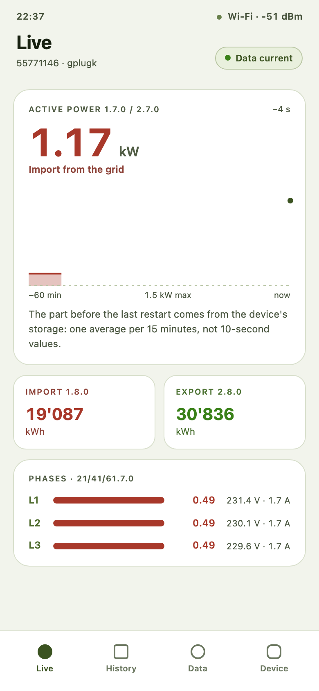
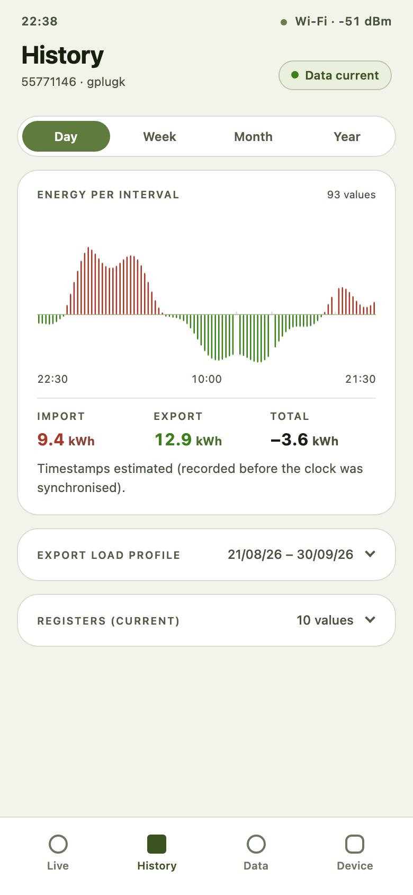
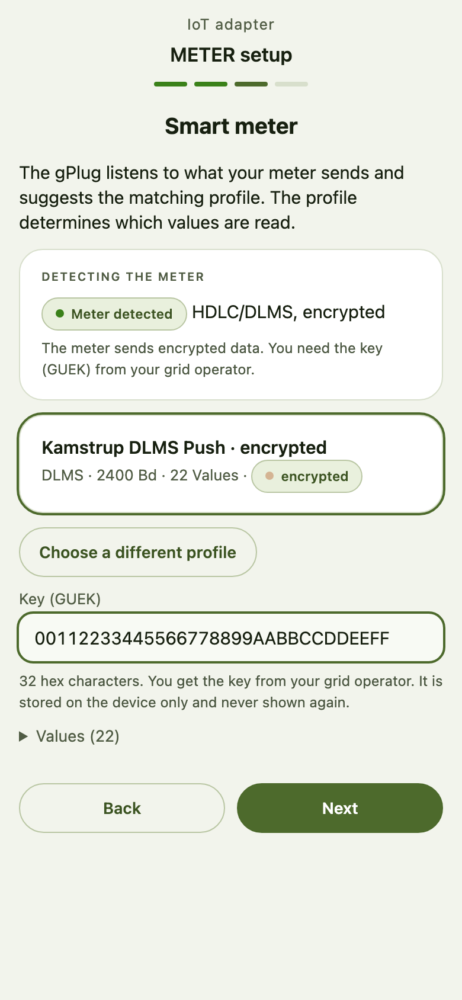

# METER — Monitoring Energy Through Every Reading

Your smart meter records every kilowatt-hour you draw from the grid and every one your solar panels
feed back. This free firmware for [gPlug](https://gplug.ch/) adapters puts those numbers on your
phone and computer: live, as a year of history, and as a file you can check your bill against. No cloud, no
account, no subscription – the app runs on the gPlug itself.

  
  &nbsp;
  
  &nbsp;
  

  
   
  Chrome or Edge on a computer and a USB cable – nothing else to install.

## What you get

- **Live power, at a glance.** How much you draw or feed in right now, the last hour as a chart, the
  meter readings exactly as your meter shows them, and power, voltage and current per phase.
- **A year of history on the device.** Energy per day, week, month and year, with totals for import,
  export and the balance. Kept across restarts and updates.
- **Your load profile as CSV.** Every 15-minute value for any period, to check your electricity bill
  or to settle a self-consumption group.
- **Setup without technical knowledge.** An assistant asks which gPlug you have, listens to your
  meter, proposes the matching profile and checks that data arrives. If something is wrong, it says
  what and takes you to the step that fixes it.
- **Updates with one tap.** The app checks for new versions when you ask and installs them over
  Wi-Fi. Your settings and history stay.
- **Your data stays at home.** Everything runs on the gPlug in your own network. The key from your
  grid operator is stored on the device and never shown or sent anywhere.
- **Works with what you already use.** Home Assistant picks the gPlug up through its ESPHome
  integration. Node-RED, ioBroker or InfluxDB get the values over MQTT, in the format you choose.
- **In your language.** German, French, Italian and English, light or dark.

## Which gPlug?

The four models sold by [gplug.ch](https://gplug.ch/produkte/): **gPlugD**, **gPlugD-E**, **gPlugK**
and **gPlugM**, with profiles for DSMR/P1 meters, Kamstrup and Landis+Gyr DLMS meters, and encrypted
meters of Swiss grid operators such as Romande Energie. One firmware serves all of them; you choose
the model in the setup assistant.

Tested on real hardware so far: the **gPlugK** on a Kamstrup meter. The other models run the same
software with their own profiles, but have not been tried on a real device yet – if you have one,
[your report](https://github.com/jluthiger/esphome-gplug/issues) helps.

## Get started

1. **Install.** Connect the gPlug to your computer with a USB cable, open the
   [web installer](https://jluthiger.github.io/esphome-gplug/) in Chrome or Edge and press
   *Install METER firmware*.
2. **Connect it to your Wi-Fi.** Plug the gPlug into your meter. On your phone, join the network
   `gPlug-Setup`; a page opens where you choose your home Wi-Fi. Note the address it shows,
   `http://gplug-xxxxxx.local/`.
3. **Set it up.** Open that address. The assistant takes you through model, meter profile and – for
   an encrypted meter – the key from your grid operator's letter, and checks that data arrives.

The [**user manual**](https://jluthiger.github.io/esphome-gplug/docs/) walks through every step and
every screen, with pictures, in German, French, Italian and English – including what to do when the
setup check reports a problem.

**Your gPlug still runs Tasmota?** Follow the [migration guide](migration.md) first. If your meter is
encrypted, it shows you how to copy the key out of Tasmota before anything is erased – that key is
the one thing you cannot get back by yourself.

**Already running this firmware?** Open the app, *Device → Firmware and restart → Check for updates*.

## Good to know

- **Early days.** This is version 0.x: a new minor version can still change things. Each release says what changed and whether you need to do anything:
  [changelog](CHANGELOG.md).
- **Meant for a home network you trust.** The ready-made firmware has no update password, so any
  device in your network can install firmware on the gPlug or read its values. On a network you share
  with people you do not trust, build a firmware with your own passwords
  ([how](DEVELOPMENT.md#cutting-a-release)). Your meter key cannot be read out either way.
- **The customer interface must be enabled.** Many grid operators switch the meter's customer
  interface on only when you ask. If the setup check reports *No signals from the meter*, that is
  the usual reason.

## Help and feedback

Questions, problems, a meter that does not work: open an
[issue](https://github.com/jluthiger/esphome-gplug/issues). Please add what the setup check or the
*Device → Event log* shows.

---

Building or changing the firmware yourself? See [DEVELOPMENT.md](DEVELOPMENT.md).
